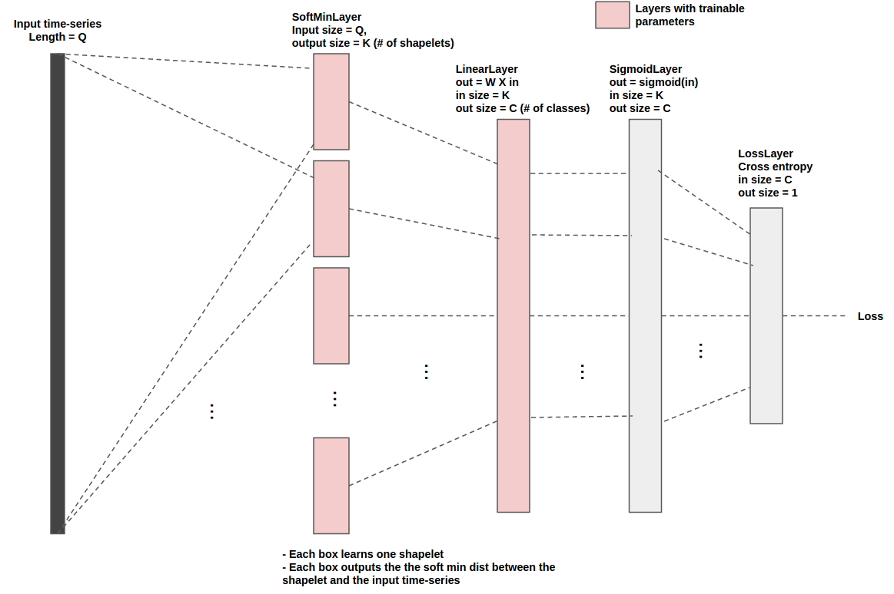

# shaplets
Python implementation of [the Learning Time-Series Shapelets method](http://www.ismll.uni-hildesheim.de/pub/pdfs/grabocka2014e-kdd.pdf), that learns a shapelet-based time-series classifier with gradient descent. 

This implementation view the model as a layered network, where each layer implements a forward, a backword and parameters update methods. This abstraction makes it easy to port the implementation to a frameworks like Torch or Tensorflow. Check the diagram at the bottom of this page.

## Usage

```python
from shapelets.classification import LtsShapeletClassifier
# create an LtsShapeletClassifier instance
classifier = LtsShapeletClassifier(K=20, R=3, L_min=30, epocs=2, regularization_parameter=0.01,
                                       learning_rate=0.01, shapelet_initialization='segments_centroids')
# train the classifier. train_data (a numpy matrix) shape is (# train samples X time-series length), train_label (a numpy matrix) is (# train samples X 1). 
classifier.fit(train_data, train_label, plot_loss=True)
# evaluate on test data. test_data (a numpy matrix) shape is (# test samples X time-series length)
prediction = classifier.predict(test_data)
```
For stable training, make sure all the timeseries in the dataset are [standardized](https://en.wikipedia.org/wiki/Feature_scaling#Standardization) (i.e. each has zero mean and unit variance). 

## Model diagram

